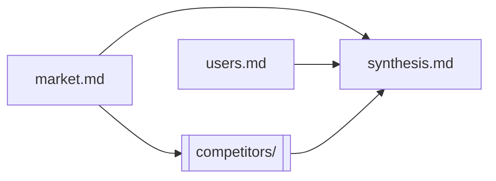

# research/ 层拓扑

(由 orchestrator 自动生成, 请勿手改)

```mermaid
flowchart LR
    competitors[["competitors/"]]
    market["market.md"]
    synthesis["synthesis.md"]
    users["users.md"]
    market --> competitors
    market --> synthesis
    users --> synthesis
    competitors --> synthesis
```
